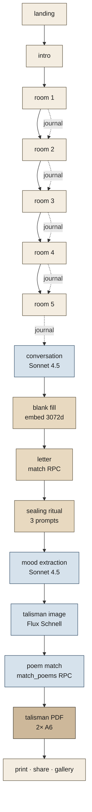
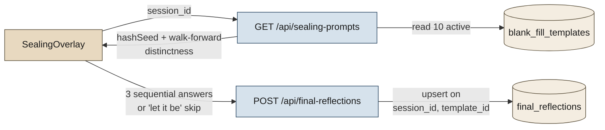
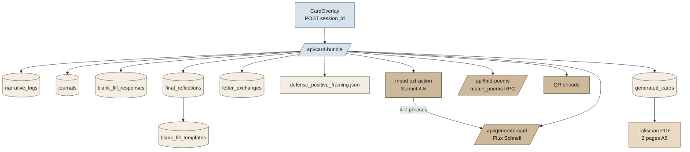

# The White Room — Technical Overview

> Research-paper reference document. Captures the complete technical architecture, data flow, and model usage as of the current implementation.

## 0. Project framing

The White Room (TWR) is a single-session journaling RPG that operationalises clinical defense-mechanism theory as game mechanics. The player traverses five 3D rooms, makes constrained choices, writes between-room journals, holds a closing dialogue with an LLM "voice," fills one blank-template sentence, receives a letter from a stranger, optionally replies, performs a three-line sealing ritual on departure, and ends with a printable talisman card. Every stage is logged, classified against a 28-defense codebook, and embedded for retrieval.

The thesis tension the system holds: **AI quantification of inner life vs. the unquantifiable**. The same techniques the work critiques (defense labelling, embedding, similarity-based matching) are used as the engine. The product side (gallery, letter, card) is then deliberately stripped of clinical labels so the meta-critique surfaces.

## 1. Stack

| Layer | Technology |
|---|---|
| Frontend framework | Next.js 16 (App Router, server components for read paths, client components for R3F) |
| 3D scene | React Three Fiber + drei (`OrbitControls`, `Environment`, GLB models per room) |
| State | Zustand (`twr/stores/gameStore.ts`) — phase, choices, oracle words, room logs |
| Styling | Tailwind v4 (utility-only, custom fonts: Instrument Serif + Zodiak) |
| Backend | Next.js Route Handlers (`twr/app/api/*`) — single Vercel deploy |
| Database | Supabase Postgres + `pgvector` (HNSW, `halfvec(3072)`) |
| LLM (analysis) | Claude Opus 4.7 (`/api/journal-label`) |
| LLM (conversation) | Claude Sonnet 4.5 (`/api/conversation`) |
| LLM (journal prompts) | Claude Sonnet 4.5 (`/api/journal-prompt`) |
| LLM (mood extraction) | Claude Sonnet 4.5 (`twr/lib/moodExtraction.ts`) |
| Embeddings | OpenAI `text-embedding-3-large` @ 3072d, stored as `halfvec(3072)` |
| Image generation | Replicate Flux Schnell (`black-forest-labs/flux-schnell`, 4 steps, 2:3 PNG) |
| PDF | `@react-pdf/renderer` (A6 portrait, two pages) |
| QR | `qrcode` Node library, base64 data URL embedded in PDF |
| Auth model | None. `crypto.randomUUID()` session id in `sessionStorage`; persistent `player_id` in `localStorage` |

## 2. Game phase flow

```
landing → intro → room1..room5 → conversation
       → blank_fill → letter → sealing → card
```



Each transition between phases triggers DB writes (logged below). The 3D rooms themselves are not procedurally generated — they are hand-curated GLB models with named meshes; mesh names key into `twr/data/events.ts` for choice prompts.

### Phase responsibilities

| Phase | Player input | Server work | Tables touched |
|---|---|---|---|
| `room1`–`room5` | object click → choice pick (one of 3-4 options) | `/api/choices-rag` lookup snapshots labels into `narrative_logs` | `narrative_logs` (W), `choices_rag` (R) |
| Inter-room transition | free-text journal (or skip / `·`) | `/api/journal-prompt` (Sonnet 4.5) generates a personalised prompt; client posts response back | `journals` (W), `narrative_logs` (R) |
| `conversation` | 6-turn LLM dialogue | `/api/conversation` lazily computes `session_analysis`, picks film stimulus by primary defense, runs Sonnet 4.5 | `session_analysis` (R/W via `/api/journal-label`), `narrative_logs`/`journals` (R) |
| `blank_fill` | one phrase fitting a template | `/api/blank-fill` embeds answer (3072d), aggregates defense from `narrative_logs` | `blank_fill_responses` (W), `blank_fill_templates` (R), `narrative_logs` (R) |
| `letter` | reply / `·` (silence) / skip | `/api/letter` runs `match_letter_for_session` RPC (cosine top-5 random within defense lane) | `letter_exchanges` (W), `seed_letters` (R), `blank_fill_responses` (R) |
| `sealing` | three blank-fill phrases (or "let it be" skip per line) | `/api/sealing-prompts` deterministic 3-pick from the `blank_fill_templates` pool; `/api/final-reflections` upserts each answer | `final_reflections` (W), `blank_fill_templates` (R) |
| `card` | print / save / share | `/api/card-bundle` orchestrates: mood extraction (Sonnet 4.5), `generate-card` (Flux), `find-poems` (poem RPC), QR encode | `generated_cards` (W), `final_reflections` (R), `narrative_logs`/`journals` (R), `poems_rag` (R), `letter_exchanges` (R) |

## 3. Database schema (17 migrations)

Migrations live in `twr/dataset/sql/` numbered `01`–`17`. Three logical tiers:

### 3.1 Reference / RAG tier (built once, read at runtime)

| Table | Migration | Rows | Purpose |
|---|---|---|---|
| `items_rag` | `03` | ~90 | DSQ-60 + DMRS-SR-30 inventory items, defense-labelled, embedded |
| `lit_rag` | `04` | ~hundreds | Clinical-literature chunks (Vaillant et al.), defense-anchored + 3-axis labels + VAD + Empath |
| `choices_rag` | `05` | 200 | Every in-game choice (`ITEMS` + `ROOM_ENTRY_EVENTS` from `twr/data/events.ts`) labelled with primary/secondary defense, weights, Vaillant level, metaphors/operations/motifs, VAD, Empath, embedding |
| `poems_rag` | `02` | curated | Korean/English poems labelled with primary/secondary defense, intensity (1-5), stance (confession/address/observation/meditation), evidence, embedding |
| `blank_fill_templates` | `10` | 10 | Static prompt templates (`나는 자주 ___ 한다`, etc.) |
| `defense_codebook` (file) | — | 28 | `twr/dataset/processed/defense_codebook.json` — synthesised from clinical sources by `build_defense_codebook.py` |
| `defense_positive_framing` (file) | — | 28 | `twr/data/defense_positive_framing.json` — `framing_en` paraphrase + `image_seed` per defense, used by Flux prompt |

Every RAG table uses the same embedding contract: `text-embedding-3-large @ 3072d → halfvec(3072) → HNSW(cosine_ops)`. RPCs return `1 - (embedding <=> query)` as `similarity`.

### 3.2 Runtime tier (one row per player session)

| Table | Migration | Rows per session | Purpose |
|---|---|---|---|
| `narrative_logs` | `06` | one per choice click (~30-60) | Snapshot of every choice with denormalised labels from `choices_rag` |
| `journals` | `09` | up to 5 | Free-text journal between rooms (also includes the post-room-5 entry) |
| `blank_fill_responses` | `10` | exactly 1 | Player's blank answer + 3072d embedding + aggregated `primary_defense` |
| `final_reflections` | `17` | up to 3 | Sealing-ritual answers, one row per `(session_id, template_id)` from the shared `blank_fill_templates` pool |
| `letter_exchanges` | `10` | exactly 1 | Which `seed_letters` row was matched, and the player's reply (or `·` sentinel) |
| `seed_letters` | `10` + `13` | 0-1 (only on share) | If player opted to share their reply, it's ingested back as `source='player'` |
| `letter_replies` | `13` | 0-N | External replies from QR-shared letter readers (cross-session) |
| `generated_cards` | `10` + `13` + `14` | exactly 1 | Talisman card row: image URL, prompt used, picked words, snapshotted poem, QR URL |
| `cards` | `06` | 1 (legacy) | Earlier ensemble RAG result; kept for parity but `session_analysis` supersedes it for current flows |
| `session_analysis` | `15` | exactly 1 | Unified end-of-session defense profile (Opus 4.7) — read by `/api/conversation` |

### 3.3 Security tier

| Migration | Effect |
|---|---|
| `08_runtime_rls_disable.sql` | Old prototyping setup — disabled RLS everywhere |
| `16_runtime_rls_enable.sql` | **Current.** RLS on for every public table. Anon (publishable key) policies on `narrative_logs`, `journals` (own-session select/insert/update), `choices_rag` (public read); all others require `service_role` |
| `17_final_reflections.sql` | Adds `final_reflections` (sealing ritual). RLS on, anon policies absent → `service_role` only via `/api/final-reflections` |

Own-session is enforced by comparing `session_id::text` against `current_setting('request.headers', true)::json->>'x-session-id'` inside policies. Browser client (`twr/lib/supabase.ts`) injects this header per session.

## 4. Embedding pipeline

Single contract across all retrieval surfaces:

| Property | Value |
|---|---|
| Model | `text-embedding-3-large` |
| Dimension | 3072 |
| Storage | `halfvec(3072)` (16-bit float) |
| Distance | cosine (`<=>`) |
| Index | HNSW with `halfvec_cosine_ops` |

What gets embedded:

| Surface | Embedded text | Use site |
|---|---|---|
| `choices_rag.embedding` | `prompt || ' ' || label` | Stream B retrieval (during R&D) |
| `lit_rag.embedding` | clinical chunk text | Stream A retrieval (during R&D) |
| `items_rag.embedding` | DSQ/DMRS item text | Stream A retrieval (during R&D) |
| `poems_rag.embedding` | poem `content` | `match_poems` RPC for talisman page-2 poem |
| `seed_letters.blank_answer_embedding` | the `blank_answer` phrase (**not** the letter body) | `match_letter_for_session` RPC |
| `blank_fill_responses.answer_embedding` | the player's blank answer | matching key for both letter and poem |

Critically: **letter bodies are not embedded**. Letter matching is keyed entirely on the short blank-fill phrase. This was a deliberate choice to keep the matching surface tied to a single explicit player utterance rather than any AI-generated summary or the long letter prose.

## 5. Defense classification system

### 5.1 The 28-defense codebook

Defined in `twr/dataset/processed/defense_codebook.json`. Each entry contains: `name`, `vaillant_level`, `definition`, `linguistic_signals[]`, `narrative_patterns[]`, `example_dsq_items[]`, `differentiation` (vs other defenses).

The codebook is synthesised by `twr/dataset/scripts/build_defense_codebook.py` which retrieves up to 10 passages per defense from the clinical-literature corpus and prompts an LLM to write the entry. Output is the canonical reference used at runtime.

Vaillant 4-level grouping (carried in `narrative_logs.vaillant_level`, `lit_rag.vaillant_level`, etc.):

| Level | Examples |
|---|---|
| `mature` | Anticipation, Affiliation, Altruism, Humor, Self-Assertion, Self-Observation, Sublimation, Suppression |
| `neurotic` | Displacement, Intellectualization, Isolation of Affect, Reaction Formation, Repression, Undoing |
| `immature` | Acting Out, Apathetic Withdrawal, Devaluation, Help-Rejecting Complaining, Idealization, Passive Aggression, Projection, Rationalization, Autistic Fantasy |
| `psychotic` | Denial, Dissociation, Omnipotence, Projective Identification, Splitting |

### 5.2 Three-axis labels (carried alongside defense)

Defined in `twr/data/_tagging_vocab.ts` (referenced as `vocab@1.0`). Used in `choices_rag`, `lit_rag`, and `narrative_logs` snapshots:

| Axis | Meaning | Storage |
|---|---|---|
| `metaphors[]` | Figurative imagery present in the text | `text[]` controlled vocab + `*_novel` overflow |
| `operations[]` | Cognitive/affective moves the speaker makes | same |
| `motifs[]` | Recurring concrete tokens / props / situations | same |
| `valence`, `arousal`, `dominance` | VAD affect coordinates | `real` |
| `empath` | Empath category scores (jsonb) + `empath_top` text[] | `lit_rag` only |

### 5.3 Where defense labels are produced

| Source | Producer | Run frequency |
|---|---|---|
| `choices_rag` rows | offline pipeline (Claude Sonnet) | once per content change |
| `narrative_logs` rows | denormalised snapshot at insert time (joined from `choices_rag`) | per choice |
| `journals.response` | currently unlabelled at insert; aggregated in `session_analysis` | end of game |
| `blank_fill_responses.primary_defense` | weighted aggregation over `narrative_logs` (primary=1.0, secondary=0.5; argmax) | once at blank-fill submit |
| `session_analysis.primary_defense` etc. | Claude Opus 4.7 reading all choices + journals, returning unified profile via tool-call schema | once at conversation phase entry |


## 6. API endpoints (Route Handlers)

All under `twr/app/api/*`. Single Vercel deploy, no separate backend.

| Route | Method | Caller | Responsibility |
|---|---|---|---|
| `/api/choices-rag` | POST | room phases | Looks up the matching `choices_rag` row by `(prompt, label)` and returns the snapshot the client persists into `narrative_logs` |
| `/api/journal-prompt` | POST | inter-room transition | Sonnet 4.5 reads recent `narrative_logs` and emits a personalised journal prompt |
| `/api/journal-label` | POST | end of game / lazy | Opus 4.7 reads the full session and writes/updates `session_analysis` |
| `/api/conversation` | POST | conversation phase | Sonnet 4.5 dialogue conditioned on `session_analysis.primary_defense` and a film-stimulus stem; up to 6 turns |
| `/api/blank-fill` | POST | blank-fill phase | Embeds the player's answer (3072d), aggregates `primary_defense` from `narrative_logs`, writes `blank_fill_responses` |
| `/api/letter` | POST | letter phase | Idempotent fetch/create via `match_letter_for_session` RPC; second call shape saves the reply |
| `/api/share-letter` | POST | letter phase | Opt-in: copies the player's reply into `seed_letters` (`source='player'`) so the next stranger can match it |
| `/api/letter-reply` | POST | QR landing page | External readers' replies land in `letter_replies` |
| `/api/sealing-prompts` | GET | sealing phase | Deterministic 3-pick from `blank_fill_templates` (`hashSeed(session_id+':a'/':b'/':c') % pool` with walk-forward distinctness) |
| `/api/final-reflections` | POST/GET | sealing phase | Upserts one `final_reflections` row per `(session_id, template_id)`; validates `template_id` against the active pool |
| `/api/find-poems` | POST | card phase | `match_poems` RPC top-1 within defense lane, falls back to no-filter top-1 |
| `/api/generate-card` | POST | card phase | Builds Flux prompt from `defense_positive_framing` + picked words, calls Replicate, returns image URL |
| `/api/card-bundle` | POST | card phase | Orchestrator: reads sealing answers, runs mood extraction (Sonnet 4.5), resolves image + poem + QR + DB insert into `generated_cards` |
| `/api/public-letter/[id]` | GET | gallery / QR | Read-only access to a single shared letter (server-side, service_role) |
| `/api/public-letters` | GET | gallery | Paginated read of `seed_letters` where `source='player'` |

## 7. Model usage

| Stage | Model | Why |
|---|---|---|
| Choice labelling (offline) | Claude Sonnet 4.5 | High throughput batch labelling of 200 choices |
| Codebook synthesis (offline) | Claude (build script) | Long-form synthesis from clinical passages |
| Per-room journal prompt | Claude Sonnet 4.5 | Short, personalised, latency-sensitive |
| Conversation (6 turns) | Claude Sonnet 4.5 | Latency + cost; conditioned on Opus-derived profile |
| Mood extraction (card phase) | Claude Sonnet 4.5 | Tool-call schema lifts 4–7 short symbolic phrases from `narrative_logs` + `journals` + `blank_fill` + `final_reflections`; flavors the Flux prompt and surfaces on the talisman PDF as small fragments |
| End-of-session analysis | **Claude Opus 4.7** | Single deep read of all choices + journals to produce unified defense profile via structured tool-call output |
| Embeddings | OpenAI `text-embedding-3-large` | 3072d, multilingual (KO/EN), `halfvec` storage |
| Talisman image | Replicate `black-forest-labs/flux-schnell` | 4 steps, 2:3 aspect, PNG; cheap and fast for one-shot generation |

Model IDs are recorded per-row where it matters (`narrative_logs.model_version`, `journals.model_version`, `session_analysis.model_version`). `schema_version` carries the tagging vocab pin (e.g. `vocab@1.0`) so retrieved labels can be re-validated against the producer.

## 8. Letter system

### 8.1 Matching

`match_letter_for_session(query_embedding, session_id, defense_filter, exclude_blank_answer, top_k)` (migration `12`):

1. Read `blank_fill_responses` for `session_id` → `(answer_embedding, primary_defense)`.
2. Cosine-rank all `seed_letters` rows where `primary_defense = defense_filter` and `origin_session_id != session_id` and `blank_answer != exclude_blank_answer`.
3. Take top-`k` (default 5), pick one at random for variety, pin into `letter_exchanges`.
4. Fallback (`*_any`): if defense lane returns nothing, drop the defense filter and repeat.

The pin is idempotent: the same `session_id` always sees the same letter on subsequent visits.

### 8.2 Seed pool

- `twr/dataset/processed/seed_letters.json` — currently 37 hand-written letters.
- Backup of fuller original set: `seed_letters.full84.bak.json` (84 rows).
- Each letter has: `primary_defense`, `author_pseudonym`, `blank_template_id`, `blank_answer`, `letter_text`, embedding of `blank_answer`.
- Defense coverage is uneven across 28 lanes — many lanes contain a single letter, so the unfiltered fallback is exercised regularly.

### 8.3 Self-extension

`share_player_letter(session_id)` RPC (migration `13`) ingests the player's `reply_text` as a new `seed_letters` row with `source='player'`, reusing the player's `blank_answer` and `answer_embedding` as the matching key. No re-embedding of `reply_text`; no LLM extraction. The pool grows as a function of opt-in shares.

### 8.4 QR loop

Each shared letter gets a public URL `${NEXT_PUBLIC_BASE_URL}/letter/[id]`. The talisman card embeds this URL as a QR code generated server-side (`qrcode` lib → base64 data URL → PDF). External visitors can leave a reply via `/api/letter-reply` which writes to `letter_replies`.

## 9. Card / talisman generation

The card phase begins with the **sealing ritual** (a short three-line departure rite) and ends with `/api/card-bundle` orchestrating image, poem, mood fragments, and QR into a printable two-page PDF.

### 9.1 Sealing ritual

`SealingOverlay.tsx` runs immediately after the letter phase and before the card. The ritual reuses the projective `blank_fill_templates` pool (10 active templates, see migration `11`) — no new vocabulary or clinical framing is introduced.



- **Deterministic 3-pick**: `hashSeed(session_id + ':a' / ':b' / ':c') % pool.length`, with walk-forward to guarantee three distinct templates. The same player on the same session always sees the same three lines in the same order.
- **Per-line skip**: each line accepts `·` (silence sentinel) or a "let it be" skip; no row is written for skipped lines.
- **No defense label**: prompts come from a pool already chosen for projective neutrality (`I left ___ behind.`, `I carry ___ with me.`, etc.).

### 9.2 `/api/card-bundle` orchestration



1. **Read** `narrative_logs`, `journals`, `blank_fill_responses`, `final_reflections` (joined to `blank_fill_templates`), `letter_exchanges`. Sealing answers are ordered by `created_at asc` to preserve submission order.
2. **Mood extraction** (`twr/lib/moodExtraction.ts`, Sonnet 4.5 with a strict tool-call schema) lifts **4–7 short symbolic phrases** — textures, affects, objects — from the assembled session text. No defense-name vocabulary, no diagnosis. The output flavors the Flux prompt and surfaces verbatim on the PDF.
3. **Image** — `/api/generate-card` combines `defense_positive_framing` (`framing_en`, `image_seed`) with the mood phrases to build a Flux prompt; Flux Schnell returns a 2:3 PNG.
4. **Poem** — `/api/find-poems` runs `match_poems` filtered by primary defense, falling back to unfiltered. Snapshotted into `generated_cards.poem_*` columns (migration `14`) for reproducibility.
5. **QR** — generated from the public letter URL (if shared) or omitted.
6. **Insert** — one row in `generated_cards`.

### 9.3 PDF layout (Option X)

`twr/components/TalismanPDF.tsx` renders two A6 portrait pages.

| Page | Content |
|---|---|
| 1 | Talisman image (centered) · the three sealing-ritual lines in italic serif (submission order) · 4–7 mood fragments scattered/faded around the margin · no defense label, no clinical framing |
| 2 | Matched poem · the player's letter reply · QR linking to the public letter (if shared) |

Typography: Instrument Serif for literary content (sealing lines, mood fragments, poem, reply), Zodiak for system/HUD metadata (timestamps, IDs).


## 10. Public gallery (Infinity Wall)

`twr/app/letters/page.tsx` renders shared player letters in a 3D scrollable wall built with R3F. Each letter is a card-mesh; clicking opens a `LetterDetailCard` overlay with the poem snapshot and reply, mirroring the talisman PDF's layout. The gallery reads from `/api/public-letters` (paginated, server-side, service_role) so the publishable key never sees `seed_letters` directly.

Like the talisman, the detail card carries no clinical defense name — only the letter text, optional poem, and pseudonym (when present from the seed pool).

## 11. Sentinel & silence

A single Unicode middle dot `·` (U+00B7) is used across the system as a sentinel for **intentional silence**:

| Site | Meaning of `·` |
|---|---|
| Journal response | The player chose to skip but acknowledged the prompt |
| Letter reply | The player read the stranger's letter and chose silence |
| Blank-fill | (rejected — blank-fill requires a phrase) |

`·` rows still pass through the same pipelines (embedding, matching) but are visually rendered as a minimal mark. This preserves the unquantifiable: silence is a recorded act, not absence.

## 12. Security & RLS

Current production policy set is in `twr/dataset/sql/16_runtime_rls_enable.sql`.

| Table | Anon (publishable) policy | Notes |
|---|---|---|
| `narrative_logs` | select/insert/update where `session_id::text = x-session-id` header | Per-session isolation |
| `journals` | same as above | Per-session isolation |
| `blank_fill_responses` | same as above | Per-session isolation |
| `letter_exchanges` | same as above | Per-session isolation |
| `cards` | same as above | Per-session isolation |
| `choices_rag` | public read | Reference data; no PII |
| `poems_rag` / `items_rag` / `lit_rag` | public read | Reference data |
| `seed_letters` / `letter_replies` / `generated_cards` / `session_analysis` / `final_reflections` | service_role only | Read/write via server routes only |

Browser client (`twr/lib/supabase.ts`) attaches the `x-session-id` header on every request. The header value is sourced from `sessionStorage` so a refresh keeps the same session. Server routes that need to bypass RLS (writing letters, reading the seed pool, inserting cards) instantiate a service-role client locally.

A live audit (anon key + curl) confirmed:
- Cross-session `narrative_logs` / `journals` / `cards` reads return empty.
- Anon writes targeting another `session_id` are rejected by `WITH CHECK`.
- `seed_letters` / `letter_replies` / `generated_cards` / `session_analysis` return 401 to anon entirely.

There is no auth: the threat model is *correlation prevention between sessions on the same client*, not authenticated multi-tenancy.

## 13. Storage & deployment

| Concern | Setup |
|---|---|
| Hosting | Vercel (single project, Next.js 16 App Router) |
| Static assets | Vercel CDN; GLB models served from `twr/public/models/` (gzipped, ~few MB each) |
| 3D models | Authored externally in DCC tools, exported as GLB; mesh names key `twr/data/events.ts` |
| Generated images | Replicate hosts the PNG; URL stored in `generated_cards.image_url` (no re-host) |
| QR images | Generated on demand server-side; embedded inline in PDF as base64, never stored |
| Environment | `OPENAI_API_KEY`, `ANTHROPIC_API_KEY`, `REPLICATE_API_TOKEN`, `SUPABASE_URL`, `SUPABASE_SERVICE_ROLE_KEY`, `NEXT_PUBLIC_SUPABASE_URL`, `NEXT_PUBLIC_SUPABASE_PUBLISHABLE_KEY`, `NEXT_PUBLIC_BASE_URL` |
| Build conventions | See `twr/AGENTS.md` — Next.js 16 has breaking changes; route handlers, params, and dynamic routes follow new conventions |

## 14. Thesis reconciliation

The system is intentionally bifurcated.

**Inside the engine** — defense classification, embedding, retrieval, similarity ranking — the player is fully quantified. Every click becomes a labelled vector; every journal becomes a profile update; every blank phrase becomes a 3072d coordinate matched against a corpus.

**At the surface** — the talisman, the gallery card, the QR letter — every clinical label is removed. The player never sees the word "Anticipation" attached to their image. The stranger's letter never carries a defense tag. The poem is matched by defense lane internally but presented as a poem, not a diagnosis. The metaphorical signature is the image itself.

This is the thesis: the AI knows the player in a particular language, but the language never reaches the player. What returns to them is unquantifiable — an image, a poem, a stranger's voice, their own reply. The classification engine produces an object that resists classification.

The system retains its records (RLS-isolated, per session) so the producer of the work, and the academic frame, can still inspect the engine. But the player's encounter is with the artifact.

## 15. File map (key references)

```
twr/
├── app/
│   ├── api/
│   │   ├── blank-fill/route.ts
│   │   ├── card-bundle/route.ts
│   │   ├── choices-rag/route.ts
│   │   ├── conversation/route.ts
│   │   ├── final-reflections/route.ts (sealing answers upsert)
│   │   ├── find-poems/route.ts
│   │   ├── generate-card/route.ts
│   │   ├── journal-label/route.ts
│   │   ├── journal-prompt/route.ts
│   │   ├── letter/route.ts
│   │   ├── letter-reply/route.ts
│   │   ├── public-letter/[id]/route.ts
│   │   ├── public-letters/route.ts
│   │   ├── sealing-prompts/route.ts   (deterministic 3-pick from blank_fill_templates)
│   │   └── share-letter/route.ts
│   ├── letters/page.tsx               (Infinity Wall gallery)
│   ├── letter/[id]/page.tsx           (QR landing)
│   └── page.tsx                       (landing → game)
├── components/
│   ├── Room.tsx                       (R3F scene per GLB)
│   ├── SealingOverlay.tsx             (3-line departure ritual)
│   ├── TalismanPDF.tsx                (PDF generator)
│   └── LetterDetailCard.tsx           (gallery overlay)
├── data/
│   ├── events.ts                      (ROOM_ENTRY_EVENTS, ITEMS, ROOM_MODELS)
│   ├── _tagging_vocab.ts              (vocab@1.0)
│   └── defense_positive_framing.json  (28-defense → framing_en + image_seed)
├── dataset/
│   ├── processed/
│   │   ├── defense_codebook.json      (28 entries)
│   │   ├── seed_letters.json          (37 letters)
│   │   └── seed_letters.full84.bak.json
│   ├── scripts/
│   │   ├── build_defense_codebook.py
│   │   ├── 13_embed_upload_seed_letters.py
│   │   └── (other ingest scripts)
│   └── sql/
│       ├── 02_poems_tagged_schema.sql
│       ├── 03_items_rag_schema.sql
│       ├── 04_lit_rag_schema.sql
│       ├── 05_choices_rag_schema.sql
│       ├── 06_runtime_schema.sql
│       ├── 09_journals_schema.sql
│       ├── 10_endgame_schema.sql
│       ├── 11_blank_fill_english.sql
│       ├── 12_letter_match_rpc.sql
│       ├── 13_letter_replies_and_share.sql
│       ├── 14_card_poem_fields.sql
│       ├── 15_session_analysis.sql
│       ├── 16_runtime_rls_enable.sql
│       └── 17_final_reflections.sql   (sealing-ritual table)
├── lib/
│   ├── moodExtraction.ts              (Sonnet 4.5 → 4-7 symbolic phrases)
│   └── supabase.ts                    (client w/ x-session-id header)
├── stores/
│   └── gameStore.ts                   (Zustand: phase, choices, oracle words)
├── public/
│   └── models/                        (r1.glb … r5.glb, finalroom.glb)
├── AGENTS.md                          (Next.js 16 breaking-change notes)
└── CLAUDE.md                          (coding rules → @AGENTS.md)
```

## 16. Open notes for the paper

- **Defense lane sparsity**: the seed letter pool covers some lanes thinly; the `_any` fallback fires often. A larger curated pool or LLM-augmented seed would reduce this, at the cost of provenance.
- **Cross-lingual embedding**: `text-embedding-3-large` handles KO/EN in one space, but same-language matches are systematically closer. Currently uncontrolled.
- **No re-embedding of player replies**: player letters re-enter the pool keyed on the original `blank_answer` embedding, not the body. Trade-off: matching surface stays small and explicit; richness of the reply is invisible to retrieval.
- **No auth**: per-session isolation via header, not identity. Adequate for the artifact's threat model (a one-session journaling experience), inadequate for any persistent account model.
- **Opus 4.7 for analysis only**: the cost-bearing single deep read is centralised; everything else (conversation, prompts) runs on Sonnet 4.5.
