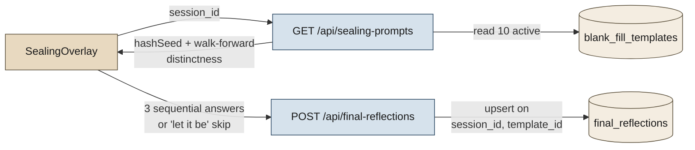
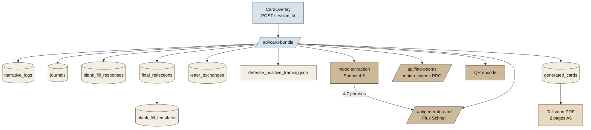

# The White Room — Technical Overview

> Research-paper reference document. Captures the complete technical architecture, data flow, and model usage as of the current implementation.

## 0. Project framing

The White Room (TWR) is a single-session journaling RPG that operationalises clinical defense-mechanism theory as game mechanics. The player traverses five 3D rooms, makes constrained choices, writes between-room journals, holds a closing dialogue with an LLM "voice," performs a three-line sealing ritual, receives a letter matched from a stranger, writes a private reply, composes their own letter (optionally entering it into the future matching pool), and ends with a printable talisman card. Every stage is logged, classified against a 28-defense codebook, and embedded for retrieval.

The thesis tension the system holds: **AI quantification of inner life vs. the unquantifiable**. The same techniques the work critiques (defense labelling, embedding, similarity-based matching) are used as the engine. The product side (gallery, letter, card) is then deliberately stripped of clinical labels so the meta-critique surfaces.

## 1. Stack

| Layer | Technology |
|---|---|
| Frontend framework | Next.js 16.2.3 (App Router, server components for read paths, client components for R3F) |
| Runtime | React 19.2 |
| 3D scene (rooms 1–5) | React Three Fiber 9 + drei 10 (`OrbitControls`, `Environment`, GLB models per room) on `three` 0.183 |
| 3D scene (landing) | `@splinetool/react-spline` 4 — Spline runtime renderer |
| Finalroom backdrop | HTML5 `<video>` looping `/finalroom.mp4`; conversation intro is a separate one-shot `/subvideo.mp4` that pauses on its last frame via `onEnded`. Previous attempts: Spline runtime, GLB — both dropped for stability |
| State | Zustand 5 (`twr/stores/gameStore.ts`) — phase, choices, collected card ids, room logs (oracle-word slot is retained as legacy and no longer written) |
| Styling | Tailwind v4 (utility-only, custom fonts: Instrument Serif + Zodiak) |
| Backend | Next.js Route Handlers (`twr/app/api/*`) — single Vercel deploy |
| Database | Supabase Postgres + `pgvector` (HNSW, `halfvec(3072)`) |
| LLM (analysis) | Claude Opus 4.7 (`/api/journal-label`, `twr/lib/sessionAnalysis.ts`) |
| LLM (conversation) | Claude Sonnet 4.5 (`/api/conversation`) |
| LLM (journal prompts) | Claude Sonnet 4.5 (`/api/journal-prompt`) |
| LLM (mood extraction) | Claude Sonnet 4.5 (`twr/lib/moodExtraction.ts`) |
| LLM safety | `twr/lib/anthropicSanitize.ts` — `stripLoneSurrogates()` + `buildAnthropicBody()` defend against orphan UTF-16 halves from player free text triggering Anthropic JSON parser 502s |
| Embeddings | OpenAI `text-embedding-3-large` @ 3072d, stored as `halfvec(3072)` |
| Image generation | Replicate Flux Schnell (`black-forest-labs/flux-schnell`, 4 steps, 2:3 PNG, Edward Gorey "Fantod Pack" prompt style — see §9.4) |
| PDF | `@react-pdf/renderer` 4 (A6 portrait, two pages); separate 50mm label PDF via `TalismanLabelPDF.tsx` |
| QR | `qrcode` Node library, base64 data URL embedded in PDF |
| Auth model | None. `crypto.randomUUID()` session id in `sessionStorage`; persistent `player_id` in `localStorage` |

## 2. Game phase flow

```
landing → intro → room1..room5 → conversation
       → sealing → letter-compose → letter (receive)
       → letter-reply → card
```

The phase enum lives in `twr/stores/gameStore.ts`. `blank_fill` no longer exists as a standalone phase: `SealingOverlay` mirrors its first answer to `/api/blank-fill` on submit so the lane signal (`blank_fill_responses.primary_defense`) is preserved without an extra screen. The endgame is **compose-first** — the player writes their own letter immediately after sealing; that letter's 3072d embedding becomes the matching key for `match_letter_for_session_v2`, which then surfaces a stranger's letter from the seed/player pool. A private reply follows. This inversion exists so matching keys off the player's full prose rather than a single sealing phrase.

```mermaid
flowchart TB
  classDef phase    fill:#f4ede1,stroke:#5a4f3a,color:#1a1a1a
  classDef ritual   fill:#e8d9c0,stroke:#5a4f3a,color:#1a1a1a
  classDef ai       fill:#d6e2ec,stroke:#2c4863,color:#1a1a1a
  classDef artifact fill:#cdb89a,stroke:#3a3225,color:#1a1a1a

  L[landing<br/>Spline]:::phase --> IN[intro<br/>video]:::phase
  IN --> R1[room 1]:::phase --> R2[room 2]:::phase --> R3[room 3]:::phase
  R3 --> R4[room 4]:::phase --> R5[room 5]:::phase
  R1 -.journal.-> R2
  R2 -.journal.-> R3
  R3 -.journal.-> R4
  R4 -.journal.-> R5
  R5 -.journal.-> CV
  CV[conversation<br/>subvideo intro<br/>Sonnet 4.5]:::ai --> SE[sealing ritual<br/>3 prompts<br/>mirror→blank_fill]:::ritual
  SE --> LC[letter-compose<br/>embed 3072d<br/>+ share?]:::ritual
  LC --> LT[letter receive<br/>v2 match RPC]:::ritual
  LT --> LR[letter-reply<br/>private]:::ritual
  LR --> MX[mood extraction<br/>Sonnet 4.5]:::ai
  MX --> IM[talisman image<br/>Flux Schnell<br/>Gorey style]:::ai
  IM --> PM[poem match<br/>match_poems RPC]:::ai
  PM --> CD[talisman PDF<br/>2× A6]:::artifact
  CD --> ENDP[print · share · gallery]:::phase
```



Each transition between phases triggers DB writes (logged below). The 3D rooms 1–5 are not procedurally generated — they are hand-curated GLB models with named meshes; mesh names key into `twr/data/events.ts` for choice prompts. The endgame scenes (sealing through card) share a single `FinalSceneShell` backdrop driven by an HTML5 `<video>` (see `FINAL_SCENE_VIDEO` in `twr/data/events.ts`); overlays stack on top.

### Phase responsibilities

| Phase | Player input | Server work | Tables touched |
|---|---|---|---|
| `room1`–`room5` | object click → choice pick (one of 3-4 options) | `/api/choices-rag` lookup snapshots labels into `narrative_logs` | `narrative_logs` (W), `choices_rag` (R) |
| Inter-room transition | free-text journal (or skip / `·`) | `/api/journal-prompt` (Sonnet 4.5) generates a personalised prompt; client posts response back | `journals` (W), `narrative_logs` (R) |
| `conversation` | 6-turn LLM dialogue (subvideo intro plays once, freezes on last frame, then VoidDialogue fades in) | `/api/conversation` lazily computes `session_analysis`, picks film stimulus by primary defense, runs Sonnet 4.5 | `session_analysis` (R/W via `getOrCreateSessionAnalysis`), `narrative_logs`/`journals` (R) |
| `sealing` | three blank-fill phrases (or "let it be" skip per line) | `/api/sealing-prompts` deterministic 3-pick from the `blank_fill_templates` pool; `/api/final-reflections` upserts each answer; first answer is mirrored to `/api/blank-fill` to populate the lane signal (`primary_defense`) | `final_reflections` (W), `blank_fill_templates` (R), `blank_fill_responses` (W via mirror) |
| `letter-compose` | pick one sealing answer → memory prompt → write own letter → archive yes/no | `/api/compose-letter` embeds the composed letter (3072d halfvec) and upserts `letter_exchanges` (this is the row's first write in compose-first flow) with `composed_letter` + `composed_letter_embedding` + `selected_template_id` + `selected_answer`; `/api/share-letter` then sets `share_choice` and (if true) runs `share_player_letter` RPC to insert into `seed_letters` as `source='player'` | `letter_exchanges` (W), `seed_letters` (W on share) |
| `letter` (receive) | acknowledge / read the matched letter | `/api/letter` runs `match_letter_for_session_v2` RPC (cosine top-5 random within defense lane, keyed on `composed_letter_embedding`), pins `received_letter_id` on `letter_exchanges` | `letter_exchanges` (W), `seed_letters` (R), `blank_fill_responses` (R for lane) |
| `letter-reply` | short private reply to the received letter (or skip) | `/api/respond-to-letter` writes `reply_text` + `reply_at` onto `letter_exchanges`; reply **never** enters `seed_letters` | `letter_exchanges` (W) |
| `card` | print / save / share | `/api/card-bundle` orchestrates: mood extraction (Sonnet 4.5), `generate-card` (Flux), `find-poems` (poem RPC), QR encode | `generated_cards` (W), `final_reflections` (R), `narrative_logs`/`journals` (R), `poems_rag` (R), `letter_exchanges` (R) |

## 3. Database schema (19 migrations)

Migrations live in `twr/dataset/sql/` numbered `02`–`19`. Three logical tiers:

### 3.1 Reference / RAG tier (built once, read at runtime)

| Table | Migration | Rows | Purpose |
|---|---|---|---|
| `items_rag` | `03` | ~90 | DSQ-60 + DMRS-SR-30 inventory items, defense-labelled, embedded |
| `lit_rag` | `04` | ~hundreds | Clinical-literature chunks (Vaillant et al.), defense-anchored + 3-axis labels + VAD + Empath |
| `choices_rag` | `05` | 200 | Every in-game choice (`ITEMS` + `ROOM_ENTRY_EVENTS` from `twr/data/events.ts`) labelled with primary/secondary defense, weights, Vaillant level, metaphors/operations/motifs, VAD, Empath, embedding |
| `poems_rag` | `02` | curated | Korean/English poems labelled with primary/secondary defense, intensity (1-5), stance (confession/address/observation/meditation), evidence, embedding |
| `blank_fill_templates` | `10` | 10 | Static prompt templates (`나는 자주 ___ 한다`, etc.) |
| `defense_codebook` (file) | — | 28 | `twr/dataset/processed/defense_codebook.json` — synthesised from clinical sources by `build_defense_codebook.py` |
| `defense_positive_framing` (file) | — | 28 | `twr/data/defense_positive_framing.json` — `framing_en` paraphrase + `image_seed` per defense, used by Flux prompt |

Every RAG table uses the same embedding contract: `text-embedding-3-large @ 3072d → halfvec(3072) → HNSW(cosine_ops)`. RPCs return `1 - (embedding <=> query)` as `similarity`.

### 3.2 Runtime tier (one row per player session)

| Table | Migration | Rows per session | Purpose |
|---|---|---|---|
| `narrative_logs` | `06` | one per choice click (~30-60) | Snapshot of every choice with denormalised labels from `choices_rag` |
| `journals` | `09` | up to 5 | Free-text journal between rooms (also includes the post-room-5 entry) |
| `blank_fill_responses` | `10` | exactly 1 | Player's blank answer + 3072d embedding + aggregated `primary_defense` |
| `final_reflections` | `17` | up to 3 | Sealing-ritual answers, one row per `(session_id, template_id)` from the shared `blank_fill_templates` pool |
| `letter_exchanges` | `10` + `18` + `19` | exactly 1 | Carries every letter-phase artifact for the session: `received_letter_id` (pinned match — the seed letter player **received**), `reply_text` + `reply_at` (private reply), `composed_letter` + `composed_letter_embedding halfvec(3072)` + `selected_template_id` + `selected_answer` + `composed_at`, `share_choice`, and `reply_letter_id` (despite the name, this now points at the **composed** letter's id in `seed_letters` when `share_choice=true` — see §16 known debt) |
| `seed_letters` | `10` + `13` + `18` | 0-1 (only on share) | If player opted to share their **composed** letter, it's ingested back as `source='player'`. The `blank_answer_embedding` column carries the composed-letter embedding for `source='player'` rows (column name kept for RPC compatibility) |
| `letter_replies` | `13` | 0-N | External replies from QR-shared letter readers (cross-session) |
| `generated_cards` | `10` + `13` + `14` | exactly 1 | Talisman card row: image URL, prompt used, picked words (mood phrases), snapshotted poem (`card_poem`, `card_poem_title`, `card_poem_author`), QR URL |
| `cards` | `06` | 1 (legacy) | Earlier ensemble RAG result; kept for parity but `session_analysis` supersedes it for current flows |
| `session_analysis` | `15` | exactly 1 | Unified end-of-session defense profile (Opus 4.7) — read by `/api/conversation` |

### 3.3 Endgame extension migrations

| Migration | Effect |
|---|---|
| `18_compose_letter.sql` | Adds `composed_letter*` / `selected_*` / `share_choice` / `composed_at` to `letter_exchanges`. Installs `match_letter_for_session_v2` + `_v2_any` (defense-filtered + unfiltered fallback). Both v2 RPCs key on `letter_exchanges.composed_letter_embedding`; lane (when filtered) still comes from `blank_fill_responses.primary_defense`. Also rewrites `share_player_letter` RPC to ingest the composed letter (rather than the reply) into `seed_letters` |
| `19_letter_reply_phase.sql` | Adds `reply_at` and re-affirms `reply_text` on `letter_exchanges`. Header comments describe the compose-first runtime ordering (see §8) and which RPCs are live vs dormant |

### 3.4 Security tier

| Migration | Effect |
|---|---|
| `08_runtime_rls_disable.sql` | Old prototyping setup — disabled RLS everywhere |
| `16_runtime_rls_enable.sql` | **Current.** RLS on for every public table. Anon (publishable key) policies on `narrative_logs`, `journals` (own-session select/insert/update), `choices_rag` (public read); all others require `service_role` |
| `17_final_reflections.sql` | Adds `final_reflections` (sealing ritual). RLS on, anon policies absent → `service_role` only via `/api/final-reflections` |

Own-session is enforced by comparing `session_id::text` against `current_setting('request.headers', true)::json->>'x-session-id'` inside policies. Browser client (`twr/lib/supabase.ts`) injects this header per session.

## 4. Embedding pipeline

Single contract across all retrieval surfaces:

| Property | Value |
|---|---|
| Model | `text-embedding-3-large` |
| Dimension | 3072 |
| Storage | `halfvec(3072)` (16-bit float) |
| Distance | cosine (`<=>`) |
| Index | HNSW with `halfvec_cosine_ops` |

What gets embedded:

| Surface | Embedded text | Use site |
|---|---|---|
| `choices_rag.embedding` | `prompt || ' ' || label` | Stream B retrieval (during R&D) |
| `lit_rag.embedding` | clinical chunk text | Stream A retrieval (during R&D) |
| `items_rag.embedding` | DSQ/DMRS item text | Stream A retrieval (during R&D) |
| `poems_rag.embedding` | poem `content` | `match_poems` RPC for talisman page-2 poem |
| `seed_letters.blank_answer_embedding` | the `blank_answer` phrase for `source='seed'` rows; the **composed letter body** for `source='player'` rows (column name preserved for back-compat) | `match_letter_for_session_v2` RPC |
| `blank_fill_responses.answer_embedding` | the player's first sealing answer (mirrored from `SealingOverlay` via `/api/blank-fill`) | unused for matching since v2 flip; `primary_defense` derived from this row still drives lane filtering |
| `letter_exchanges.composed_letter_embedding` | the player's composed letter body (3072d halfvec) | **current matching key** via `match_letter_for_session_v2` |

**Dual-embedding asymmetry (open issue).** The v2 RPC compares the player's composed letter (~200-600 chars) against `seed_letters.blank_answer_embedding`. For `source='player'` rows that column holds the composed letter body — symmetric long↔long matching. For `source='seed'` rows (the 67 hand-written letters in `dataset/processed/seed_letters.json`, loaded via `13_embed_upload_seed_letters.py`) the column still holds the embedding of the **short blank_answer phrase** (~5 words). The pool is therefore mixed, and until the seed rows are re-embedded against `letter_text`, cross-source matches lean on whatever signal survives the length asymmetry. A backfill that re-embeds `letter_text` into the same column for `source='seed'` is the cleanest fix and is low-cost (67 rows × `text-embedding-3-large`).

## 5. Defense classification system

### 5.1 The 28-defense codebook

Defined in `twr/dataset/processed/defense_codebook.json`. Each entry contains: `name`, `vaillant_level`, `definition`, `linguistic_signals[]`, `narrative_patterns[]`, `example_dsq_items[]`, `differentiation` (vs other defenses).

The codebook is synthesised by `twr/dataset/scripts/build_defense_codebook.py` which retrieves up to 10 passages per defense from the clinical-literature corpus and prompts an LLM to write the entry. Output is the canonical reference used at runtime.

Vaillant 4-level grouping (carried in `narrative_logs.vaillant_level`, `lit_rag.vaillant_level`, etc.):

| Level | Examples |
|---|---|
| `mature` | Anticipation, Affiliation, Altruism, Humor, Self-Assertion, Self-Observation, Sublimation, Suppression |
| `neurotic` | Displacement, Intellectualization, Isolation of Affect, Reaction Formation, Repression, Undoing |
| `immature` | Acting Out, Apathetic Withdrawal, Devaluation, Help-Rejecting Complaining, Idealization, Passive Aggression, Projection, Rationalization, Autistic Fantasy |
| `psychotic` | Denial, Dissociation, Omnipotence, Projective Identification, Splitting |

### 5.2 Three-axis labels (carried alongside defense)

Defined in `twr/data/_tagging_vocab.ts` (referenced as `vocab@1.0`). Used in `choices_rag`, `lit_rag`, and `narrative_logs` snapshots:

| Axis | Meaning | Storage |
|---|---|---|
| `metaphors[]` | Figurative imagery present in the text | `text[]` controlled vocab + `*_novel` overflow |
| `operations[]` | Cognitive/affective moves the speaker makes | same |
| `motifs[]` | Recurring concrete tokens / props / situations | same |
| `valence`, `arousal`, `dominance` | VAD affect coordinates | `real` |
| `empath` | Empath category scores (jsonb) + `empath_top` text[] | `lit_rag` only |

### 5.3 Where defense labels are produced

| Source | Producer | Run frequency |
|---|---|---|
| `choices_rag` rows | offline pipeline (Claude Sonnet) | once per content change |
| `narrative_logs` rows | denormalised snapshot at insert time (joined from `choices_rag`) | per choice |
| `journals.response` | currently unlabelled at insert; aggregated in `session_analysis` | end of game |
| `blank_fill_responses.primary_defense` | weighted aggregation over `narrative_logs` (primary=1.0, secondary=0.5; argmax) | once when `SealingOverlay` mirrors its first answer to `/api/blank-fill` |
| `session_analysis.primary_defense` etc. | Claude Opus 4.7 reading all choices + journals, returning unified profile via tool-call schema | once at conversation phase entry (lazy `getOrCreateSessionAnalysis`) |


## 6. API endpoints (Route Handlers)

All under `twr/app/api/*`. Single Vercel deploy, no separate backend. The `choices_rag` lookup that used to be `/api/choices-rag` is now resolved client-side via `twr/lib/choicesIndex.ts` (~200 rows mirrored in-memory on page load) and written through `twr/lib/narrativeLog.ts` directly into `narrative_logs` using the anon publishable key under RLS. There is no longer a server round-trip per choice click.

| Route | Method | Caller | Responsibility |
|---|---|---|---|
| `/api/journal-prompt` | POST | inter-room transition | Sonnet 4.5 emits a two-line worldbuilding prompt anchored on a hardcoded `ANCHORS` phrase. When `seed_cards` is non-empty the user message prepends a `PICKED: the player just chose N images they could not look away from` line so the LLM begins from the pull of the picked images, then enters the anchor as sensory grounding. `narrative_logs` are counted (metadata) but not fed to the LLM. Legacy `seed_words` field is accepted but ignored (see `twr/ORACLE_WORDS.md`) |
| `/api/journal-label` | POST | end of game / lazy | Opus 4.7 reads the full session and writes/updates `session_analysis` |
| `/api/conversation` | POST | conversation phase | Sonnet 4.5 dialogue conditioned on `session_analysis.primary_defense` and a film-stimulus stem; up to 6 turns. Server uses `getOrCreateSessionAnalysis` to lazily compute the profile on first call |
| `/api/sealing-prompts` | GET | sealing phase | Deterministic 3-pick from `blank_fill_templates` (`hashSeed(session_id+':a'/':b'/':c') % pool` with walk-forward distinctness) |
| `/api/final-reflections` | POST/GET | sealing phase | Upserts one `final_reflections` row per `(session_id, template_id)`; validates `template_id` against the active pool |
| `/api/blank-fill` | POST | sealing phase (mirror) | Called by `SealingOverlay` with the first sealing answer. Embeds the answer (3072d), aggregates `primary_defense` from `narrative_logs`, writes `blank_fill_responses`. The original standalone blank-fill phase is gone — the row exists only so `primary_defense` (lane signal) is available to `match_letter_for_session_v2` |
| `/api/compose-letter` | POST | letter-compose phase (first letter endpoint) | Embeds the composed letter (3072d halfvec), **upserts** `letter_exchanges` with `composed_letter` + `composed_letter_embedding` + `selected_template_id` + `selected_answer` + `composed_at`. Creates the row in compose-first flow. Resets `share_choice` to NULL |
| `/api/share-letter` | POST | letter-compose phase (after compose) | `share=true` sets `share_choice=true` and runs `share_player_letter` RPC to insert the composed letter into `seed_letters` as `source='player'`; returns `qr_url`. `share=false` just records the decision. Idempotent on repeat share=true |
| `/api/letter` | POST | letter (receive) phase | Idempotent: first call runs `match_letter_for_session_v2` RPC (cosine top-5 random within defense lane, keyed on `composed_letter_embedding`) and pins `received_letter_id` on `letter_exchanges`. Returns 425 if `composed_letter_embedding` is not yet present |
| `/api/respond-to-letter` | POST | letter-reply phase | Writes `reply_text` + `reply_at` onto `letter_exchanges`. Requires `received_letter_id`. Reply is **private** — never enters `seed_letters` |
| `/api/letter-reply` | POST | QR landing page (external) | External readers' replies via QR scan land in `letter_replies` with `delivered=false`. Distinct from `/api/respond-to-letter` |
| `/api/letter-inbox` | GET | gallery / author re-entry | Returns `letter_replies` for a `letter_id`, gated on the requester's persistent `player_id` matching the seed letter's `origin_player_id`. Marks fetched replies `delivered=true` |
| `/api/find-poems` | POST | card phase | `match_poems` RPC top-1 within defense lane, falls back to no-filter top-1 |
| `/api/generate-card` | POST | card phase | Builds Flux prompt from `defense_positive_framing` + picked mood words, calls Replicate Flux Schnell, returns image URL. Prompt block order is fixed (see `twr/CARD_GENERATION.md` §4) |
| `/api/card-bundle` | POST | card phase | Orchestrator: reads sealing answers, runs `extractMoodWords` (Sonnet 4.5), resolves image + poem + QR + DB insert into `generated_cards`. Idempotent on PK conflict |
| `/api/analyze-patterns` | POST | — | Stub (`{ ok: false, todo: true }`). Reserved for an offline RAG batch over `narrative_logs`; not in the live flow |

Routes referenced in earlier drafts of this document — `/api/choices-rag`, `/api/public-letter/[id]`, `/api/public-letters` — no longer exist. The choice snapshot path moved client-side; the public letter page lives at `twr/app/letter/[id]/page.tsx` and reads Supabase directly under RLS rather than going through an API route.

## 7. Model usage

| Stage | Model | Why |
|---|---|---|
| Choice labelling (offline) | Claude Sonnet 4.5 | High throughput batch labelling of 200 choices |
| Codebook synthesis (offline) | Claude (build script) | Long-form synthesis from clinical passages |
| Per-room journal prompt | Claude Sonnet 4.5 | Short, personalised, latency-sensitive |
| Conversation (6 turns) | Claude Sonnet 4.5 | Latency + cost; conditioned on Opus-derived profile |
| Mood extraction (card phase) | Claude Sonnet 4.5 | Tool-call schema lifts 4–7 short symbolic phrases from `narrative_logs` + `journals` + `blank_fill` + `final_reflections`; flavors the Flux prompt and surfaces on the talisman PDF as small fragments |
| End-of-session analysis | **Claude Opus 4.7** | Single deep read of all choices + journals to produce unified defense profile via structured tool-call output |
| Embeddings | OpenAI `text-embedding-3-large` | 3072d, multilingual (KO/EN), `halfvec` storage |
| Talisman image | Replicate `black-forest-labs/flux-schnell` | 4 steps, 2:3 aspect, PNG; cheap and fast for one-shot generation |

Model IDs are recorded per-row where it matters (`narrative_logs.model_version`, `journals.model_version`, `session_analysis.model_version`). `schema_version` carries the tagging vocab pin (e.g. `vocab@1.0`) so retrieved labels can be re-validated against the producer.

## 8. Letter system

The letter system spans three player-facing phases (`letter-compose` → `letter` → `letter-reply`) plus two external touchpoints (QR landing, author inbox). All five surfaces write to a single `letter_exchanges` row, created by compose-letter and updated in place by every subsequent endpoint.

### 8.1 Compose (write own letter first)

In `letter-compose` the player:

1. Picks one of their three sealing answers as a seed phrase.
2. Receives a memory-prompt scaffold (UI-side, no LLM).
3. Writes their own letter to a future stranger.
4. Chooses whether to archive it (`/api/share-letter`).

`/api/compose-letter` embeds the composed letter (`text-embedding-3-large` 3072d → `halfvec(3072)`) and **upserts** `letter_exchanges` — this is the row's first write in compose-first flow. Persisted fields: `composed_letter`, `composed_letter_embedding`, `selected_template_id`, `selected_answer`, `composed_at`. `share_choice` is reset to NULL on every compose call so `/api/share-letter` remains the single explicit gate for archive insertion.

### 8.2 Matching (receive)

`match_letter_for_session_v2(p_session_id)` (migration `18`), with `*_v2_any` as the unfiltered fallback:

1. Read `letter_exchanges` for `session_id` → `composed_letter_embedding`. This row exists because compose-letter ran first.
2. Read `blank_fill_responses.primary_defense` for the lane filter (mirrored by `SealingOverlay`).
3. Cosine-rank all `seed_letters` rows where `primary_defense = me.primary_defense` and `origin_session_id != session_id` (or NULL for `source='seed'`).
4. Take top-5, pick one at random for variety, pin into `letter_exchanges.received_letter_id`.
5. Fallback (`_v2_any`): if the defense lane returns nothing, drop the defense filter and repeat.

The pin is idempotent — the same `session_id` always sees the same matched letter on subsequent visits. `/api/letter` returns `425` while `composed_letter_embedding` is still being written (defensive — the compose submit is awaited client-side).

### 8.3 Private reply

After receiving, the player writes a short reply through `LetterReplyOverlay` → `/api/respond-to-letter`. The reply is stored as `letter_exchanges.reply_text` + `reply_at` and is **never** propagated to `seed_letters`. It exists only on the session row; the only external read path is `/api/letter-inbox`, gated on the original author's `player_id`.

### 8.4 Seed pool and self-extension

- `twr/dataset/processed/seed_letters.json` — currently 67 hand-written letters (37 original + 30 added in the 591d9b9 backfill to cover 13 underrepresented defenses with 2–3 metaphorical, "I am here"-tone letters each).
- Backup of fuller original set: `seed_letters.full84.bak.json` (84 rows). Pre-backfill snapshot: `seed_letters.before_30.bak.json`.
- Each letter has: `primary_defense`, `author_pseudonym`, `blank_template_id`, `blank_answer`, `letter_text`. The current `13_embed_upload_seed_letters.py` script embeds `blank_answer` into `blank_answer_embedding` and dedups on `(primary_defense, blank_answer)` so re-runs are safe.
- Defense coverage is more even after the backfill but still thinner on a handful of lanes — the unfiltered `_any` fallback still fires.
- **v2 caveat**: seed rows are short-phrase-embedded while player rows are full-body-embedded (see §4 dual-embedding asymmetry). Re-embedding `letter_text` for the 67 seeds into the same column is the recommended backfill before v2 ships to wider playtest.

`share_player_letter(session_id)` RPC (migration `18`, rewritten from `13`) ingests the player's **composed** letter as a new `seed_letters` row with `source='player'`. The composed letter's embedding lands in `blank_answer_embedding` (name preserved for RPC compatibility) and `letter_text` carries the composed text. The pool grows as a function of opt-in archives.

### 8.5 QR loop

Each shared letter gets a public URL `${NEXT_PUBLIC_BASE_URL}/letter/[id]`. The talisman card embeds this URL as a QR code generated server-side (`qrcode` lib → base64 data URL → PDF). External visitors can leave a reply via `/api/letter-reply` which writes to `letter_replies` (`delivered=false`). The original author retrieves these via `/api/letter-inbox`, gated on persistent `player_id`; successful fetches flip `delivered=true`.

## 9. Card / talisman generation

The endgame is a chain: **sealing ritual** → letter compose → letter receive → letter reply → card. The card phase itself is the final orchestration via `/api/card-bundle` over image, poem, mood fragments, and QR into a printable two-page PDF. See `twr/CARD_GENERATION.md` for the full pipeline-level walkthrough.

### 9.1 Sealing ritual

`SealingOverlay.tsx` runs **immediately after the conversation phase**, before any letter phase. Its first answer is also mirrored to `/api/blank-fill` so the lane signal (`blank_fill_responses.primary_defense`) used by `match_letter_for_session_v2` is populated without exposing a separate blank-fill screen to the player. The ritual reuses the projective `blank_fill_templates` pool (10 active templates, see migration `11`) — no new vocabulary or clinical framing is introduced.



- **Deterministic 3-pick**: `hashSeed(session_id + ':a' / ':b' / ':c') % pool.length`, with walk-forward to guarantee three distinct templates. The same player on the same session always sees the same three lines in the same order.
- **Per-line skip**: each line accepts `·` (silence sentinel) or a "let it be" skip; no row is written for skipped lines.
- **No defense label**: prompts come from a pool already chosen for projective neutrality (`I left ___ behind.`, `I carry ___ with me.`, etc.).

### 9.2 `/api/card-bundle` orchestration



1. **Read** `narrative_logs`, `journals`, `blank_fill_responses`, `final_reflections` (joined to `blank_fill_templates`), `letter_exchanges`. Sealing answers are ordered by `created_at asc` to preserve submission order.
2. **Mood extraction** (`twr/lib/moodExtraction.ts`, Sonnet 4.5 with a strict tool-call schema) lifts **4–7 short symbolic phrases** — textures, affects, objects — from the assembled session text. No defense-name vocabulary, no diagnosis. The output flavors the Flux prompt and surfaces verbatim on the PDF.
3. **Image** — `/api/generate-card` combines `defense_positive_framing` (`framing_en`, `image_seed`) with the mood phrases to build a Flux prompt; Flux Schnell returns a 2:3 PNG.
4. **Poem** — `/api/find-poems` runs `match_poems` filtered by primary defense, falling back to unfiltered. Snapshotted into `generated_cards.poem_*` columns (migration `14`) for reproducibility.
5. **QR** — generated from the public letter URL (if shared) or omitted.
6. **Insert** — one row in `generated_cards`.

### 9.3 PDF layout (Option X)

`twr/components/TalismanPDF.tsx` renders two A6 portrait pages. A separate `TalismanLabelPDF.tsx` renders a 50mm square label variant.

| Page | Content |
|---|---|
| 1 | Talisman image (centered) · the three sealing-ritual lines in italic serif (submission order) · 4–7 mood fragments scattered/faded around the margin · no defense label, no clinical framing |
| 2 | Matched poem · the player's **composed letter** (not the private reply) · QR linking to the public letter URL (if archived via `/api/share-letter`) |

Typography: Instrument Serif for literary content (sealing lines, mood fragments, poem, composed letter), Zodiak for system/HUD metadata (timestamps, IDs).

The private reply (`letter_exchanges.reply_text`) is **not** on the PDF — it stays on the session row, retrievable only by the original letter's author via `/api/letter-inbox`.


## 10. Public gallery (Infinity Wall)

`twr/app/letters/page.tsx` renders shared player letters in a 3D scrollable wall built with R3F. Each letter is a card-mesh; clicking opens a `LetterDetailCard` overlay with the poem snapshot and composed letter, mirroring the talisman PDF's page 2 layout. The gallery reads `seed_letters` (where `source='player'`) directly through the anon publishable key under RLS — there is no `/api/public-letters` route anymore. The individual letter detail page at `twr/app/letter/[id]/page.tsx` does the same.

Like the talisman, the detail card carries no clinical defense name — only the letter text, optional poem, and pseudonym (when present from the seed pool).

## 11. Sentinel & silence

A single Unicode middle dot `·` (U+00B7) is used across the system as a sentinel for **intentional silence**:

| Site | Meaning of `·` |
|---|---|
| Journal response | The player chose to skip but acknowledged the prompt |
| Letter reply (private) | The player read the stranger's letter and chose silence; `reply_text = '·'` |
| Letter compose | (rejected — composing requires a phrase) |
| Sealing line | Each of the 3 lines accepts `·` or a "let it be" skip; skip writes nothing |

`·` rows still pass through the same pipelines (embedding, matching where applicable) but are visually rendered as a minimal mark. This preserves the unquantifiable: silence is a recorded act, not absence.

## 12. Security & RLS

Current production policy set is in `twr/dataset/sql/16_runtime_rls_enable.sql`.

| Table | Anon (publishable) policy | Notes |
|---|---|---|
| `narrative_logs` | select/insert/update where `session_id::text = x-session-id` header | Per-session isolation |
| `journals` | same as above | Per-session isolation |
| `blank_fill_responses` | same as above | Per-session isolation |
| `letter_exchanges` | same as above | Per-session isolation |
| `cards` | same as above | Per-session isolation |
| `choices_rag` | public read | Reference data; no PII |
| `poems_rag` / `items_rag` / `lit_rag` | public read | Reference data |
| `seed_letters` | public read where `source='player'` | Gallery + `/letter/[id]` reads under anon |
| `letter_replies` / `generated_cards` / `session_analysis` / `final_reflections` | service_role only | Read/write via server routes only |

Browser client (`twr/lib/supabase.ts`) attaches the `x-session-id` header on every request. The header value is sourced from `sessionStorage` so a refresh keeps the same session. Server routes that need to bypass RLS (writing letters, reading the seed pool, inserting cards) instantiate a service-role client locally.

A live audit (anon key + curl) confirmed:
- Cross-session `narrative_logs` / `journals` / `cards` reads return empty.
- Anon writes targeting another `session_id` are rejected by `WITH CHECK`.
- `seed_letters` / `letter_replies` / `generated_cards` / `session_analysis` return 401 to anon entirely.

There is no auth: the threat model is *correlation prevention between sessions on the same client*, not authenticated multi-tenancy.

## 13. Storage & deployment

| Concern | Setup |
|---|---|
| Hosting | Vercel (single project, Next.js 16 App Router) |
| Static assets | Vercel CDN; GLB models served from `twr/public/models/` (gzipped, ~few MB each) |
| 3D models | Authored externally in DCC tools, exported as GLB; mesh names key `twr/data/events.ts` |
| Generated images | Replicate hosts the PNG; URL stored in `generated_cards.image_url` (no re-host) |
| QR images | Generated on demand server-side; embedded inline in PDF as base64, never stored |
| Environment | `OPENAI_API_KEY`, `ANTHROPIC_API_KEY`, `REPLICATE_API_TOKEN`, `SUPABASE_URL`, `SUPABASE_SERVICE_ROLE_KEY`, `NEXT_PUBLIC_SUPABASE_URL`, `NEXT_PUBLIC_SUPABASE_PUBLISHABLE_KEY`, `NEXT_PUBLIC_BASE_URL` |
| Build conventions | See `twr/AGENTS.md` — Next.js 16 has breaking changes; route handlers, params, and dynamic routes follow new conventions |
| Kiosk auto-reset | `app/page.tsx` runs a 10 s-poll effect once the app is past `landing`. Any pointer / key / touch / wheel / mouse event resets a counter; after 30 min idle it calls `window.location.reload()` to hard-reset Three.js scenes, video timers, and in-memory session for the next visitor. `landing` is exempt to avoid an empty-booth reload loop. Independent of `lib/useIdleTracker.ts` (which gates overlay reveal animations) |

## 14. Thesis reconciliation

The system is intentionally bifurcated.

**Inside the engine** — defense classification, embedding, retrieval, similarity ranking — the player is fully quantified. Every click becomes a labelled vector; every journal becomes a profile update; every blank phrase becomes a 3072d coordinate matched against a corpus.

**At the surface** — the talisman, the gallery card, the QR letter — every clinical label is removed. The player never sees the word "Anticipation" attached to their image. The stranger's letter never carries a defense tag. The poem is matched by defense lane internally but presented as a poem, not a diagnosis. The metaphorical signature is the image itself.

This is the thesis: the AI knows the player in a particular language, but the language never reaches the player. What returns to them is unquantifiable — an image, a poem, a stranger's voice, their own reply. The classification engine produces an object that resists classification.

The system retains its records (RLS-isolated, per session) so the producer of the work, and the academic frame, can still inspect the engine. But the player's encounter is with the artifact.

## 15. File map (key references)

```
twr/
├── app/
│   ├── api/
│   │   ├── analyze-patterns/route.ts   (stub — reserved)
│   │   ├── blank-fill/route.ts         (mirrored from SealingOverlay)
│   │   ├── card-bundle/route.ts        (talisman orchestrator)
│   │   ├── compose-letter/route.ts     (letter-compose: embed + persist)
│   │   ├── conversation/route.ts       (6-turn Sonnet 4.5)
│   │   ├── final-reflections/route.ts  (sealing answers upsert)
│   │   ├── find-poems/route.ts
│   │   ├── generate-card/route.ts      (Flux Schnell)
│   │   ├── journal-label/route.ts      (Opus 4.7 session analysis)
│   │   ├── journal-prompt/route.ts     (inter-room Sonnet 4.5)
│   │   ├── letter/route.ts             (receive — match RPC)
│   │   ├── letter-inbox/route.ts       (author-only reply inbox)
│   │   ├── letter-reply/route.ts       (external QR reply)
│   │   ├── respond-to-letter/route.ts  (private internal reply)
│   │   ├── sealing-prompts/route.ts    (deterministic 3-pick)
│   │   └── share-letter/route.ts       (compose → archive opt-in)
│   ├── letters/page.tsx                (Infinity Wall gallery)
│   ├── letter/[id]/page.tsx            (QR landing)
│   └── page.tsx                        (landing → game)
├── components/
│   ├── Room.tsx                        (R3F scene per GLB; glow registry)
│   ├── RoomIntro.tsx                   (per-room title fade-in)
│   ├── EventOverlay.tsx                (object-click choice picker)
│   ├── JournalingOverlay.tsx           (inter-room free-text + tarot-deck card fan-out)
│   ├── CardToast.tsx                   (bottom-left "+1 card" pickup notification)
│   ├── CollectedWordsPanel.tsx         (legacy oracle word ribbon — not mounted)
│   ├── VoidDialogue.tsx                (6-turn conversation UI)
│   ├── SealingOverlay.tsx              (3-line departure ritual)
│   ├── LetterOverlay.tsx               (receive)
│   ├── LetterReplyOverlay.tsx          (private reply)
│   ├── LetterComposeOverlay.tsx        (own letter + archive choice)
│   ├── CardOverlay.tsx                 (card-bundle trigger)
│   ├── TalismanPDF.tsx                 (A6 ×2 PDF)
│   ├── TalismanLabelPDF.tsx            (50mm label variant)
│   ├── LetterGallery.tsx               (Infinity Wall R3F scene)
│   └── LetterDetailCard.tsx            (gallery overlay)
│   # finalroom backdrop (<video src={FINAL_SCENE_VIDEO}>) and
│   # the subvideo conversation intro are inlined in app/page.tsx
│   # rather than extracted into their own components.
├── data/
│   ├── events.ts                       (ROOM_ENTRY_EVENTS, ITEMS, ROOM_MODELS, FINAL_SCENE_VIDEO)
│   ├── _tagging_vocab.ts               (vocab@1.0)
│   ├── readymadeCards.ts               (43-id pool + pickReadymadeCard — see ORACLE_WORDS.md)
│   ├── oracleWords.ts                  (legacy 80-phrase pool, retained for re-entry)
│   └── defense_positive_framing.json   (28-defense → framing_en + image_seed)
├── dataset/
│   ├── processed/
│   │   ├── defense_codebook.json       (28 entries)
│   │   ├── seed_letters.json           (67 letters: 37 original + 30 backfill)
│   │   ├── seed_letters.before_30.bak.json
│   │   └── seed_letters.full84.bak.json
│   ├── scripts/
│   │   ├── build_defense_codebook.py
│   │   ├── 13_embed_upload_seed_letters.py
│   │   └── (other ingest scripts)
│   └── sql/
│       ├── 02_poems_tagged_schema.sql
│       ├── 03_items_rag_schema.sql
│       ├── 04_lit_rag_schema.sql
│       ├── 05_choices_rag_schema.sql
│       ├── 06_runtime_schema.sql
│       ├── 09_journals_schema.sql
│       ├── 10_endgame_schema.sql
│       ├── 11_blank_fill_english.sql
│       ├── 12_letter_match_rpc.sql
│       ├── 13_letter_replies_and_share.sql
│       ├── 14_card_poem_fields.sql
│       ├── 15_session_analysis.sql
│       ├── 16_runtime_rls_enable.sql
│       ├── 17_final_reflections.sql    (sealing-ritual table)
│       ├── 18_compose_letter.sql       (composed_* + v2 RPCs + rewritten share)
│       └── 19_letter_reply_phase.sql   (reply_at; compose-first header)
├── lib/
│   ├── anthropicSanitize.ts            (lone-surrogate stripper + body builder)
│   ├── choicesIndex.ts                 (client-side choices_rag mirror)
│   ├── narrativeLog.ts                 (per-choice narrative_logs writer)
│   ├── moodExtraction.ts               (Sonnet 4.5 → 4-7 symbolic phrases)
│   ├── sessionAnalysis.ts              (Opus 4.7 lazy compute / getOrCreateSessionAnalysis)
│   ├── embeddings.ts                   (OpenAI text-embedding-3-large helper)
│   ├── prompts.ts                      (shared prompt-template helpers)
│   ├── assets.ts                       (Supabase Storage URL resolver)
│   ├── session.ts                      (getSessionId / getPlayerId)
│   ├── useIdleTracker.ts               (idle detection hook)
│   └── supabase.ts                     (client w/ x-session-id header)
├── stores/
│   └── gameStore.ts                    (Zustand: phase, choices, collectedCards, room logs; collectedWords retained as legacy)
├── public/
│   ├── models/                         (r1.glb … r5.glb)
│   ├── models/readymade_cards/         (43 PNGs — in-game pickup + tarot fan-out)
│   ├── assets/                         (R4 poster hi-res PNGs)
│   └── subvideo.mp4                    (conversation intro — one-shot, pauses on last frame)
├── TECH_OVERVIEW.md                    (this file)
├── CARD_GENERATION.md                  (talisman pipeline deep dive)
├── ORACLE_WORDS.md                     (in-game word-fragment system)
├── AGENTS.md                           (Next.js 16 breaking-change notes)
└── CLAUDE.md                           (coding rules → @AGENTS.md)
```

### Companion documents

- **`twr/CARD_GENERATION.md`** — full talisman generation pipeline: `extractMoodWords` → `generate-card` (Flux) → `find-poems` → QR → `@react-pdf/renderer`. Includes the Gorey-style prompt block order and idempotency semantics.
- **`twr/ORACLE_WORDS.md`** — in-game **card pickups** collected from each `EventOverlay` choice (`CardToast` bottom-left notification) and surfaced as a tarot-deck fan-out in `JournalingOverlay`. Documents the readymade card pool, the `seed_cards` signal used by `/api/journal-prompt` (count-only PICKED line, not card ids), and the legacy oracle-word phrase system it replaced.
- **`twr/ARCHITECTURE_DEEP.md`** — code walkthrough with file:line references for one full playthrough (landing → R1 mount → choice → narrative_logs INSERT → … → card PDF). Targeted at developer onboarding / re-entry.

## 16. Open notes for the paper

- **Defense lane sparsity**: the seed letter pool covers some lanes thinly; the `_any` fallback fires often. A larger curated pool or LLM-augmented seed would reduce this, at the cost of provenance.
- **Cross-lingual embedding**: `text-embedding-3-large` handles KO/EN in one space, but same-language matches are systematically closer. Currently uncontrolled.
- **Seed pool dual-embedding asymmetry**: with v2 live, `seed_letters.blank_answer_embedding` is the embedding of the short `blank_answer` phrase for `source='seed'` rows but the long composed-letter body for `source='player'` rows. The matching space is therefore mixed in length/style. The 67 seed letters should be re-embedded against `letter_text` for symmetry — low-cost backfill, no schema change.
- **`letter_exchanges.reply_letter_id` is mis-named under compose-first**: the column was introduced in migration `13` to pin the seed-letter id created when a player chose to publicise their reply. Migration `18` rewrote `share_player_letter` to ingest the **composed** letter instead (the reply stayed private and now lives in `reply_text` + `reply_at`), but the column name was kept for RPC/code back-compat. So today `reply_letter_id` actually means "id of the shared composed letter in `seed_letters`". A rename to `shared_letter_id` (+ corresponding `share_player_letter` RPC and `/api/share-letter` / `/api/card-bundle` reads) would remove the cognitive overlap with `received_letter_id` (the matched seed letter the player *receives*); both columns are seed-letter foreign keys on the same row and the names actively mislead. Low-risk migration but touches the QR code path and `card-bundle.shared` boolean.
- **No auth**: per-session isolation via header, not identity. Adequate for the artifact's threat model (a one-session journaling experience), inadequate for any persistent account model.
- **Opus 4.7 for analysis only**: the cost-bearing single deep read is centralised; everything else (conversation, prompts) runs on Sonnet 4.5.
